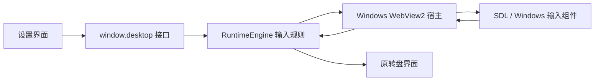

# 架构与界面改版

程序分为界面、输入规则、平台宿主和原生输入组件四层。设置页只负责展示和收集用户操作，输入规则不依赖页面布局。Windows 层负责持久化、窗口/托盘和原生服务。

`RuntimeEngine` 运行在设置 WebView2 中，设置隐藏后也必须保持运行。宿主禁用后台计时器节流，退出时停止输入服务；透明转盘窗口使用鼠标穿透与不激活窗口，保留打字应用的焦点。此行为需在实际桌面验收。

重绘设置界面时可以替换页面布局、控件、图标和导航，并保持 `window.desktop` 方法及事件形状兼容。不要更改 `assets/exact/` 与对应的 Figma 布局数据，也不要把输入状态绑定到是否选中某个设置页。原来的独立输入模块与配置规范继续保留。

宿主只加载虚拟本地域名 `https://maties.local` 下的发布文件；阻止新窗口、下载和网页权限请求。系统写入和原生组件操作仅接受设置页消息。设置页不获取任意路径读写或任意程序执行接口。

存储继续使用 `%APPDATA%/ControllerCompanion` 下的三份配置文件。更新或修复不删除这些文件。WebView2 的共享运行环境不打入包；恢复包只备份三个原生输入文件。
